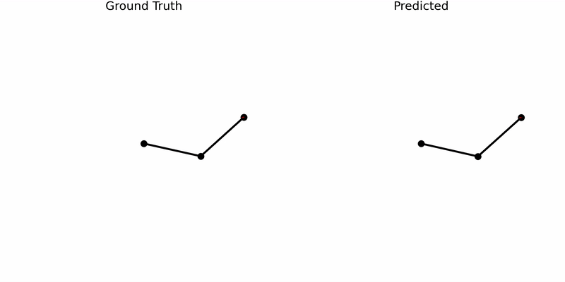
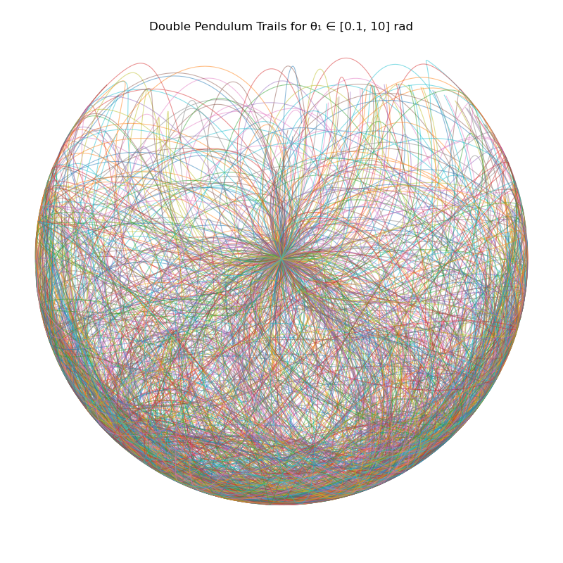

# theta_omega (θω)

This project uses an LSTM-based neural network to predict the **initial state** of a chaotic double pendulum system, using only its **5-second motion trail**.



_In this simulation, I first predicted the initial state using our LSTM model, then used `compare_pen.py` to simulate both the predicted state and the true state for comparison._

Predicting the underlying state of a physical system like a double pendulum from its motion is a classic inverse problem. The system is **chaotic**, meaning small changes in the initial state lead to wildly different outcomes. This project focuses on inferring that initial state using deep learning.



_Trajectories of a chaotic double pendulum for 100 different initial values of θ₁ (0.1 to 10 radians, θ₂ fixed at 2.0). Each colorful curve shows the tip’s path over 10 seconds, highlighting the system’s sensitivity to initial conditions._

## The Model Architecture

1. LSTM Layer
   The first part is a Long Short-Term Memory (LSTM) network. LSTMs are great for sequence data because they can “remember” information over long time spans. Here, the LSTM reads the entire sequence of 300 steps, each with 6 features.
2. Fully Connected Layers
   After the LSTM, I take its final hidden state—a summary of the whole sequence. This summary is passed through a series of fully connected (dense) layers, which gradually reduce the dimensionality and learn to map the sequence summary to the 4 target values.

```
Input: (batch, 300, 6)
         |
         v
+-----------------------------+
|         LSTM                |  # 2 layers, hidden size 128
+-----------------------------+
         |
         v
Take last hidden state: (batch, 128)
         |
         v
+-----------------------------+
|   Fully Connected Layers    |
|   Linear(128→128) + ReLU    |
|   Linear(128→64)  + ReLU    |
|   Linear(64→4)              |
+-----------------------------+
         |
         v
Output: (batch, 4)  # Predicted initial state
```

## Data Format

Each data sample is a time series:

- **Trail**: (x, y) positions of the pendulum over 300 time steps.
- **State**: Corresponding angles and angular velocities at each step.
- **Label**: The true initial state `[θ₁, ω₁, θ₂, ω₂]`.

Combined input shape:  
`(300, 6)` → `[x, y, θ₁, ω₁, θ₂, ω₂]` per time step.

## Training Details

- **Loss**: Mean Squared Error (MSE)
- **Optimizer**: AdamW
- **Batch Size**: 32
- **Epochs**: 25 (early stopping based on validation loss)
- **Split**: 80% training / 10% validation / 10% test
- **Framework**: PyTorch

## Installation

```bash
git clone https://github.com/xtrupal/theta_omega.git
cd theta_omega
```

## License

MIT
